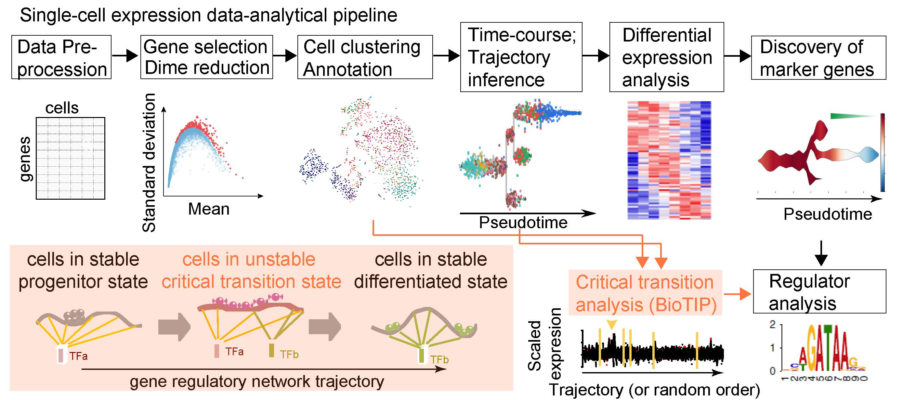
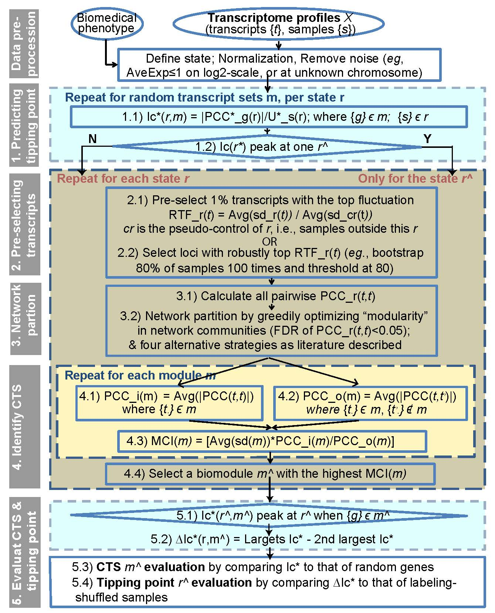

# BioTIP: an R-package for Characterization of Biological Tipping-Points
### What is BioTIP?
Abrupt and irreversible changes (or tipping points) are decisive in the progression of biological processes. BioTIP is an R-package for characterization of biological tipping-points. BioTIP is the first toolset that amalgamates two computational impediments: (1) detection of tipping-points accurately, and (2) identification of non-stochastic critical transition signals (CTSs). 

### Why BioTIP?
BioTIP addresses and shows robust performance regarding 3 technical challenges in the existing tipping-point methods:

1. Large variability often exists in the sizes of statistical ensembles (populations);  
2. Not only multiple tipping points may coexist during an observed progression but also multiple CTSs may coexist in the same critical transition state; and  
3. There are multiple trajectories when cells are exposed to stimulus.

### Where to apply BioTIP?
To adopt tipping-point theory to transcriptomic analysis, there are two common premises:  

1. The system of the individual cell has a dissipative structure (e.g., having discrete states 
2. Including the one showing multi-stability);  
each state has a characteristic gene expression profile and thus presents a distinct molecular phenotype.  

BioTIP apply to data meeting these premises, including both single-cell and bulk-cell transcriptomes. The impending-transition states are called ‘critical transition states’ or ‘tipping points.’

We have applied BioTIP to identify temporal features of molecular-network dynamics from gene expression profiles successfully. Importantly, the CTS identifications helped infer the underlying gene-regulatory network and the involving key transcription factors.




Overview of BioTIP.



### How to install?
To use the newest BioTIP package, either clone/download this repository, or you can install BioTIP with:

```r
library("devtools")
devtools::install_github("xyang2uchicago/BioTIP")
```

You can install the released version of BioTIP from [CRAN](https://CRAN.R-project.org) with:

``` r
install.packages("BioTIP")
```
or even better:
``` r
source('http://bioconductor.org/biocLite.R')
biocLite("BioTIP")
```

### Example
Here are example case analysis applied to bulk and single-cell datasets:
[BioTIP Applications](https://github.com/xyang2uchicago/BioTIP_application).

## Enjoy!

